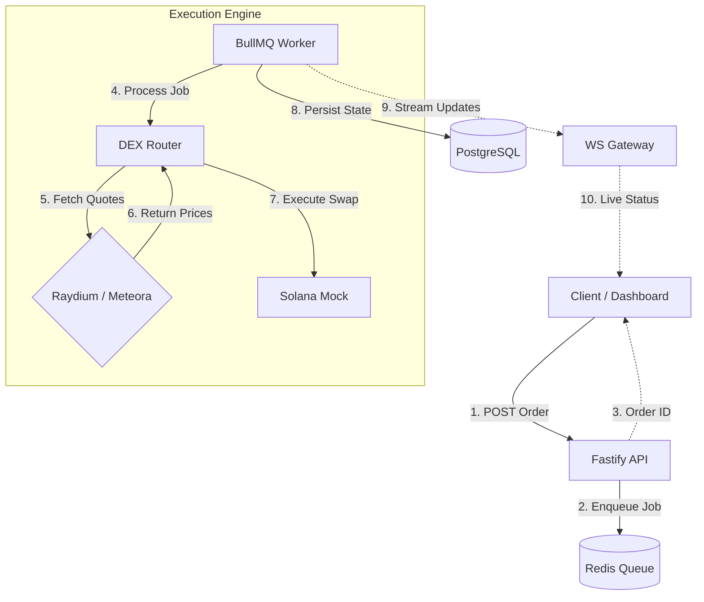

# 🚀 Eterna Order Execution Engine

**High-performance trading infrastructure for Solana DEXs.**

Eterna is a backend system designed to simulate **institutional-grade order execution**. It handles **Market Orders** by intelligently routing trades between **Raydium** and **Meteora** to ensure the best execution price, using a **high-concurrency, event-driven architecture**.

---

## 🏗 Architecture

The system follows an **Event-Driven Architecture** to ensure **non-blocking execution**, **high throughput**, and **real-time updates**.

📂 Project Structure
Bash

src/
├── api/
│   ├── routes.ts         # HTTP Endpoints
│   └── websocket.ts      # WebSocket Connection Handler
├── services/
│   ├── dex/              # Mock DEX Router Logic
│   └── queue/            # BullMQ Worker & Producer
├── types/                # TypeScript Interfaces
└── app.ts                # Application Entry Point
⚡ Execution Flow Summary
Client submits an order via HTTP.

API validates the request and enqueues the job in Redis.

BullMQ Worker processes the order asynchronously.

DEX Router fetches quotes from Raydium and Meteora.

Best Route is selected automatically.

Swap Execution is simulated on the blockchain.

State is persisted in PostgreSQL.

Real-time updates are streamed via WebSockets.

✨ Key Features
⚡ Market Order Execution: Immediate execution at the best available price.

🔀 Smart DEX Routing: Real-time price comparison between Raydium and Meteora.

📡 Real-Time Updates: WebSocket streaming of order lifecycle:

pending → routing → building → submitted → confirmed

🛡 High Concurrency: BullMQ + Redis for concurrent processing with retries and exponential backoff.

💾 Audit & Reliability: Full execution history stored in PostgreSQL.

🧠 Design Decisions
Why Market Orders?
I selected Market Orders as the core order type because they represent the fundamental unit of DEX interaction. Optimizing market orders requires solving the hardest latency problems: rapid quote comparison and immediate transaction submission.

Extensibility: Limit and Sniper orders can be built on top of this engine by adding a price-monitoring service that triggers this exact execution flow.

Why this Tech Stack?
Fastify vs Express: Chosen for its lower overhead and built-in async/await support, which is critical for high-frequency trading systems.

BullMQ: Decouples the API from the Execution logic. If the DEXs are slow or the network is congested, the API remains responsive. It also handles exponential backoff, ensuring failed transactions are retried intelligently.

Prisma: Provides type-safety between the database and the application layer, reducing runtime errors.

🛠 Tech Stack
Runtime: Node.js, TypeScript

API: Fastify (HTTP + WebSockets)

Queue: BullMQ + Redis

Database: PostgreSQL (Prisma ORM)

Infrastructure: Docker

🚀 Getting Started
Follow these steps to run the engine locally.

Prerequisites
Node.js (v18+)

Docker Desktop (Must be running)

1. Installation
Bash

git clone https://github.com/anikettP/eterna-execution-engine.git
cd eterna-execution-engine
npm install
2. Start Infrastructure
Bash

docker compose up -d
3. Setup Database
Bash

npx prisma migrate dev --name init
4. Run the Engine
Bash

npm run dev
The server will start at http://localhost:3000.

🧪 How to Test
Option A: The Dashboard (Recommended)
I have included a custom HTML dashboard to visualize the order flow easily.

Ensure the server is running.

Open the file test-client.html in your browser.

Click "Confirm Transaction" to see the full lifecycle (Pending → Routing → Confirmed).

Option B: Postman / API
1. Submit Order

URL: http://localhost:3000/api/orders/execute

Method: POST

Body:

JSON

{
  "pair": "SOL-USDC",
  "amount": 10,
  "side": "buy"
}
2. Listen for Updates

URL: ws://localhost:3000/ws/orders/{orderId}

Method: WebSocket
